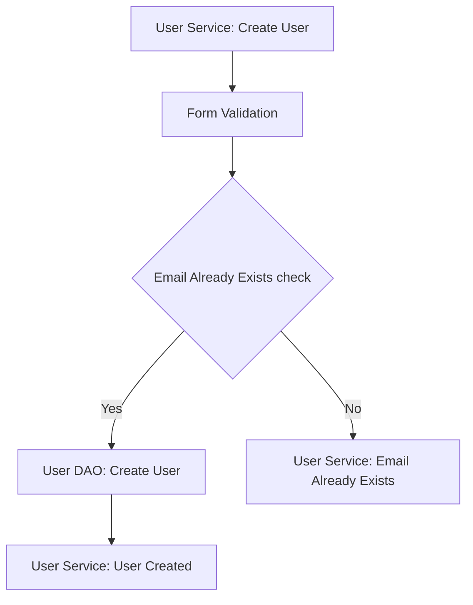
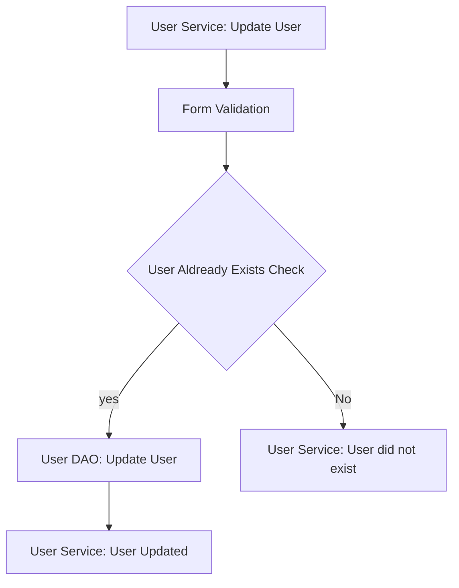
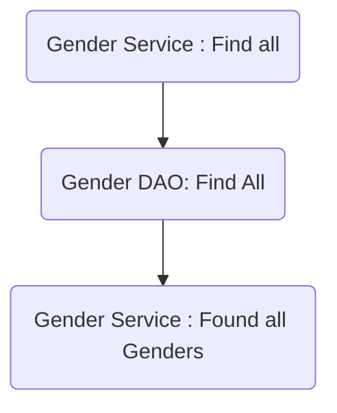

# My Fashion Studio Checklist

## Database Design

- [ ] Create an ER diagram of the database
- [ ] Write Create table scripts [](src/main/resources/db/migration/V1__create_users.sql)

## Project Setup

- [ ] Create a new Java project
- [ ] Set up a MySQL database
- [ ] Add necessary libraries
	- [ ] JDBC, 
	- [ ] MySQL Connector, 
	- [ ] JUnit, 
	- [ ] Dotenv

## Module: User

### Feature 1: Create User
>Create a new user in database.

#### Pre-requisites:
- [ ]  user table
- [ ]  user model
- [ ]  user DAO(create)
- [ ]  user service(create)
#### Validations:
- [ ] form validation
	-  username (null,empty)
	- password (null, empty,pattern)
	- phone number (>  6000000000,pattern)
- [ ] business validation
	- email uniqueness check  

#### Messages:

  * User cannot be null  
  * Username cannot be null
  * Email cannot be null or empty
  * Email doesn't match the pattern
  * Password cannot be null or empty
  * Password does not match the pattern
  * Phone number cannot  be null or empty
  * Phone number does not match the pattern
  * Email aldready exists

#### Flow: 



### Feature 2: Update user details
>Update the existing user in database.

#### Pre-requisites:

- [ ] complete the user module - Create user feature
- [ ] User Service(update)
- [ ] User Dao(update)

#### Validations:
- [ ]  Form validation
	-  User input validation (username,password) 
- [ ]  Business validation
	-  User aldready exists check 

#### Messages:
  * User cannot be null  
  * Username cannot be null
  * Email cannot be null or empty
  * Email doesn't match the pattern
  * Password cannot be null or empty
  * Password does not match the pattern
  * Phone number cannot  be null or empty
   * Phone number does not match the pattern
  * Id should be above 0  
  * User does not exists

#### Flow:



## Module: Gender

### Feature 1: list all genders
> find all genders from Database

#### Pre-requisites:
- [ ] genders table with records
- [ ] gender DAO (find all)
- [ ] gender Service (find all)

#### Flow:


## Module: Category

### Feature 1: list all categories by gender_id
>  find all categories by gender_id from Database 

#### Pre-requisites:
- [ ] complete gender module 
- [ ] create categories table
- [ ] category DAO (find all)
- [ ] category Service (findAll, findById)

#### validations:
- [ ] form validation
	-   input validation (genderid) 
- [ ] bussiness validation 
	-  gender aldready exists check

#### Messages:

  * gender id should be above 0
  * gender does not exist

#### Flow:
```mermaid
graph TD;
  A[Category Service: Find all categories by genderId] --> B[Form Validation]
  B --> C{gender aldready exists Check}
  C -- yes--> D[Catgeory DAO: find all categories by gender id]
  D --> E[Category Service: Found all categories by gender]
  C -- No --> F[Category Service: gender does not exist]
  ```


 

## Module: Size
### Feature 1: list all sizes

> find all sizes from database
#### Pre-requisites:
- [ ] create size table 
- [ ] size model
- [ ] size DAO(find all)
- [ ] size service (find all)

#### Flow:
```mermaid  
graph TD;  
A(Size Service : Find all) --> B( Size DAO: Find All)  
B --> C(Size Service : Found all sizes)  
```


## Module: Price

### Feature 1: update End_date 

> update end_date in price table
- [ ] create price table 
- [ ] price model
- [ ] price DAO(update End_date )
- [ ] price service (update End_date )

### Feature 2: Create Price

> create price in price table
- [ ] create price table 
- [ ] price model
- [ ] price DAO(Create Price)
- [ ] price service (Create Price)

## Module: Product
### Feature 1: Create product
#### Pre-requisites:

 - [ ] complete gender module
 - [ ] complete category module
 - [ ] complete size module
 - [ ] complete price module
 - [ ] create products table
 - [ ] product model
 - [ ] product service 
 - [ ] product DAO 
 - [ ] price model
 - [ ] price service (create)
 - [ ] price DAO(create) 

#### validations:
- [ ] form validation
	- Product input validation (product_id,name,size_id,price) 
- [ ] bussiness validation 
	-  product_id exists,
	- size_id exists


#### Messages:

  * Product cannot be null  
  * Product name cannot be null or empty
  * Product description cannot be null or empty
  * Price for this product aldready exists


#### Flow:
```mermaid
graph TD;
  A[Product Service: Create Product] --> B[Form Validation]
  B -- Yes --> C[Product DAO : Create Product]
  C	--> D[Price Service : Create Price]
  D	--> E{business Validation}
  E-- No --> F[Price DAO : Create Price]
  E-- yes --> G[Price Service : Price for this product aldready exists]
  F --> H[Price Service : Product created]
  B -- No --> g[Product Service : Invalid Product Details]
  ```


### Feature 2: List all products
#### Pre-requisites:
 - [ ] Complete the gender module.
 - [ ] Complete the category module.
 - [ ] Complete the size module.
 - [ ] Complete the price module.
 - [ ] Create the products table.
 - [ ] product model
 - [ ] Product service ( find all )
 - [ ] Product DAO ( find all )


#### Flow:
```mermaid  
graph TD;  
A(Product Service : Find all) --> B( Product DAO: Find All)  
B --> C(Product Service : Found all Products)  
```


### Feature 3: find product details by product id

#### Pre-requisites:

 - [ ] Complete the gender module.
 - [ ] Complete the category module.
 - [ ] Complete the size module.
 - [ ] Complete the price module.
 - [ ] Create the products table.
 - [ ] product model
 - [ ] Product service ( find product details by product ID )
 - [ ] Product DAO ( find product details by product ID )

#### Validations:

 - [ ] Form validation
	- Product input validation(product_id)
 - [ ] business validation
	 - Product aldready exists

#### Messages:

  * Product id should be above 0
  * Product does not exist


#### Flow:

```mermaid
graph TD;
  A[product Service: Find product Details] --> B[Form Validation]
  B	-- yes --> C{business validaton}
  C -- Yes --> D["product Dao : Find product Details"]
  D --> E["product Service: Product Details Found"]
  C -- No --> F["Product Service : Product does not exist"]
  B -- No --> G["Product Service : Invalid input"]
  ```


### Feature 4: Update product details

>Update product details in product table

#### Pre-requisites:
 - [ ] complete gender module
 - [ ] complete category module
 - [ ] complete size module
 - [ ] complete price module
 - [ ] create products table
 - [ ] product model
 - [ ] product service (Update product details)
 - [ ] product DAO (Update product details)
 
#### Validations:

 - [ ] Form validation
	- Product input validation(product_id,name,description)
 - [ ] business validation
	 - Product aldready exists  


#### Messages:

  * Product id should be above 0
  * Product name cannot be null or empty
  * Product description cannot be null or empty
  * Product does not exist
		
#### Flow:

```mermaid
graph TD;
  A[product Service: Update product Details] --> B[Form Validation]
  B	-- yes --> C{business validaton}
  C -- Yes --> D["product Dao : Update product Details"]
  D --> E["product Service: Product Details Updated"]
  C -- No --> F["Product Service : Product does not exist"]
  B -- No --> G["Product Service : Invalid input"]
  ```


  
### Feature 5: Update product price

#### Pre-requisites:
>Update product price in prices table in Database
 - [ ] complete gender module
 - [ ] complete category module
 - [ ] complete size module
 - [ ] complete price module
 - [ ] complete products table
 - [ ] price model
 - [ ] price service (update End_date ) 
 - [ ] price DAO(update End_date ) 
 - [ ] price service (create price) 
 - [ ] price DAO(create price) 

 
#### Validations:

 - [ ] Form validation
	- Product price input validation(product_id,size_id,price)
 - [ ] business validation
	 - Product aldready exist (if product id & size_id exists)
	 - Product aldready exist (if the enddate exists)
	 
#### Messages:

  * Product id should be above 0
  * Product name cannot be null or empty
  * Product description cannot be null or empty
  * Product does not exists
  * Product price aldready exists

#### Flow:
```mermaid
graph TD;
  A[price Service: Update product price] --> B[Form Validation]
  B	-- yes --> C{business validaton}
  C -- Yes --> D["Price Dao : update Product EndDate"]
  D --> E["Price Service: Product EndDate updated"]
  E --> F{business validation}
  F-- yes --> G["Price Service: create price"]
  G--> H["Price DAO: create price"]
  H--> I["Price Service: Product Price Created"]
F-- No--> J["Price Service: Product aldready exist"]
  C -- No --> K["Price Service : Product does not exist"]
  B -- No --> L["Price Service : Invalid input"]
  ```


 

  
### Feature 6: list all products by category_id
>Find all products by category_id from  Database
#### Pre-requisites:
 - [ ] complete gender module
 - [ ] complete category module
 - [ ] complete size module
 - [ ] complete price module
 - [ ] create product model
 - [ ] product model
 - [ ] product service (find all products by category_id)
 - [ ] product DAO (find all products by category_id)

#### Validations:

 - [ ] Form validation
	- Category input validation(category_id)
 - [ ] business validation
	 - Category aldready exists  

#### Messages:

  * category id should be above 0
  * Category does not exists

#### Flow:
```mermaid
graph TD;
  A[Product Service: Find all products by category_id] --> B[Form Validation]
  B	-- yes --> C{business validaton}
  C -- Yes --> D["Product Dao : Find all products by category_id"]
  D --> E["Product Service: Found all products by category_id"]
  C -- No --> F["Product Service : Category does not exist"]
  B -- no --> G["Product Service : Invalid category_id"]
  ```


